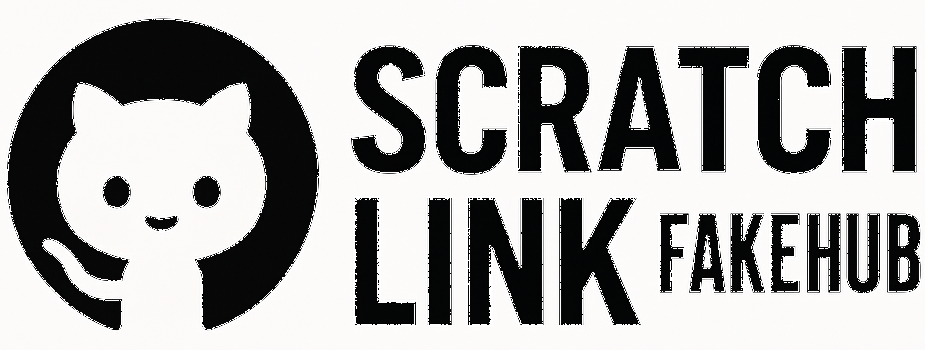

= scratchlink-fakehub

:toc:
:toc-title: Table of Contents
:icons: font

A lightweight WebSocket server emulating Scratch Link BLE devices – specifically LEGO® WeDo 2.0 peripherals.

== Quick Start

[source,bash]
----
pip install -r requirements.txt
python3 main.py
----

Note: Scratch must be open and Scratch Link must be accessible on port 20111.

== Project Overview

`scratchlink-fakehub` simulates BLE peripherals via WebSockets for Scratch. It implements parts of the Scratch Link JSON-RPC protocol and is ideal for development and testing without real hardware.

== Supported Devices

Currently emulates:

- Port 1: Distance Sensor (Input)
- Port 2: Tilt Sensor (Input)

Ports and device types are configurable.

== Protocol Structure & Communication

=== JSON-RPC Overview

Scratch Link communicates via JSON-RPC. Each message contains a method, optional params, and an ID.

[source,json]
----
{
  "jsonrpc": "2.0",
  "method": "startNotifications",
  "params": {
    "serviceId": "...",
    "characteristicId": "..."
  },
  "id": 4
}
----

=== Supported Methods

[cols="1,3"]
|===
| `discover`         | Search for devices
| `connect`          | Connects to the fake device
| `startNotifications` | Starts notification loop
| `stopNotifications`  | Stops notification loop
| `write`            | For motor commands
| `read`             | Read sensor value once
|===

== WeDo 2.0 Specification

Based on reverse-engineering documentation at https://ofalcao.pt/blog/series/wedo-2-0-reverse-engineering

=== UUIDs

[cols="1,2"]
|===
| `PORT_SERVICE`       | 00001523-1212-efde-1523-785feabcd123
| `PORT_CHAR`          | 00001527-1212-efde-1523-785feabcd123
| `PORT_NOTIFY_CHAR`   | 00001528-1212-efde-1523-785feabcd123
| `SENSOR_SERVICE`     | 00004f0e-1212-efde-1523-785feabcd123
| `SENSOR_CHAR`        | 00001560-1212-efde-1523-785feabcd123
| `CTRL_CHAR_TX`       | 00001565-1212-efde-1523-785feabcd123
|===

These UUIDs define how the simulated device exposes characteristics for motor, LED, sensor values, and notification control.

== Sensor Value Handling

=== Trigger Principle

Scratch only detects new values if an intermediate dummy value (e.g., 0) is sent before the target value.

[source,python]
----
await send(0)     # Dummy impulse
await send(30)    # Actual value
----

This is required due to how Scratch deduplicates incoming BLE notifications.

=== characteristicDidChange

The method `characteristicDidChange` is how the fake hub pushes sensor or state changes to Scratch Link.

It must be used with `startNotifications` beforehand, or Scratch will ignore the data.

== Byte Message Explanation

Example JSON-RPC message:

[source,json]
----
{
  "jsonrpc": "2.0",
  "method": "characteristicDidChange",
  "params": {
    "serviceId": "00001523-1212-efde-1523-785feabcd123",
    "characteristicId": "00001527-1212-efde-1523-785feabcd123",
    "encoding": "base64",
    "message": "BQEU"
  }
}
----

Decoded message (`base64.b64decode("BQEU")`) → `[0x05, 0x01, 0x14]`

- `0x05`: Notification prefix (fixed)
- `0x01`: Port 1
- `0x14`: Decimal 20 (value)

For tilt: `[0x05, port, x, y]` → each axis ranges from 0 to 255

== Encoding Details

=== `encode_attach(port, device)`

This announces a device (e.g., distance sensor) connected to a port.

[source,python]
----
bytes([
  port, 0x01, 0x00, DEVICE_TYPES[device],
  0x00, 0x01, 0x01, 0x10,
  0x00, 0x00, 0x00, 0x10
])
----

Explanation:

- `port`: Port index (1–2)
- `0x01, 0x00`: Hub capabilities (fixed)
- `DEVICE_TYPES[device]`: 0x23 (distance), 0x22 (tilt), 0x01 (motor)
- Remaining: likely mode & unit setup. Reverse-engineered but partially undocumented.

=== `encode_sensor(port, device)`

Generates the correct sensor payload depending on device type.

[source,python]
----
# Distance Sensor
[0x05, port, value]

# Tilt Sensor
[0x05, port, x, y]

# Motor Sensor
[0x05, port, speed]
----

== Example: Distance Sensor Loop

[source,python]
----
device.set_distance(50)
await asyncio.sleep(0.05)
#device.set_distance(0)   # Reset, this happens automatically in the python class
await asyncio.sleep(0.05)
device.set_distance(50)  # Trigger again
----

This ensures Scratch receives the updated distance.

== Tilt Trigger Mapping

The following methods define simulated tilt directions:

[source,python]
----
def tilt_up(self):    self.set_tilt(0, 60)
def tilt_down(self):  self.set_tilt(0, 30)
def tilt_left(self):  self.set_tilt(60, 0)
def tilt_right(self): self.set_tilt(30, 0)
----

Thresholds for x/y axis were determined empirically. Scratch blocks trigger based on crossing value thresholds. Scratch ignores gradual or unchanged values.

== Communication Flow

[source,plantuml]
----
@startuml
title WeDo 2.0 ScratchLink Protocol

Scratch -> ScratchLink: discover
ScratchLink -> FakeHub: discover
FakeHub -> ScratchLink: didDiscoverPeripheral

Scratch -> ScratchLink: connect
ScratchLink -> FakeHub: connect

Scratch -> ScratchLink: startNotifications
ScratchLink -> FakeHub: startNotifications
FakeHub -> ScratchLink: characteristicDidChange (attach)

loop Every interval
    FakeHub -> ScratchLink: characteristicDidChange (sensor value)
end

Scratch -> ScratchLink: stopNotifications
ScratchLink -> FakeHub: stopNotifications

@enduml
----

== References

- https://ofalcao.pt/blog/series/wedo-2-0-reverse-engineering
- https://github.com/LLK/scratch-link
